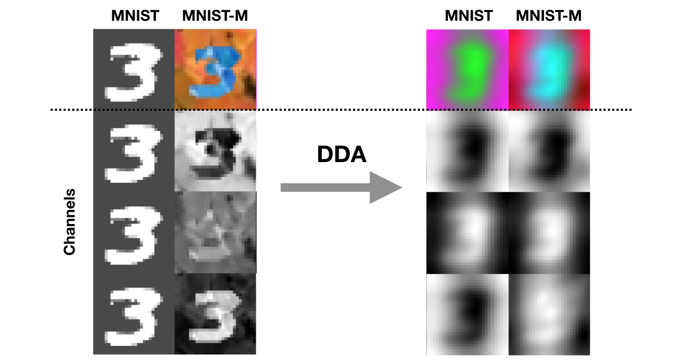
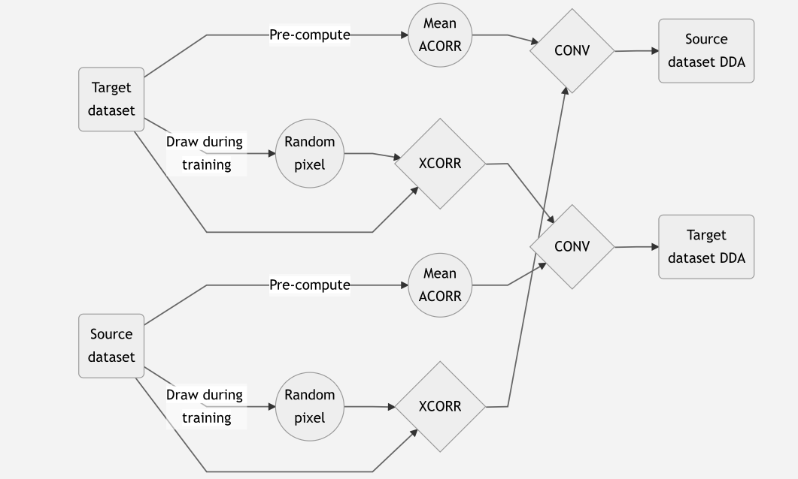
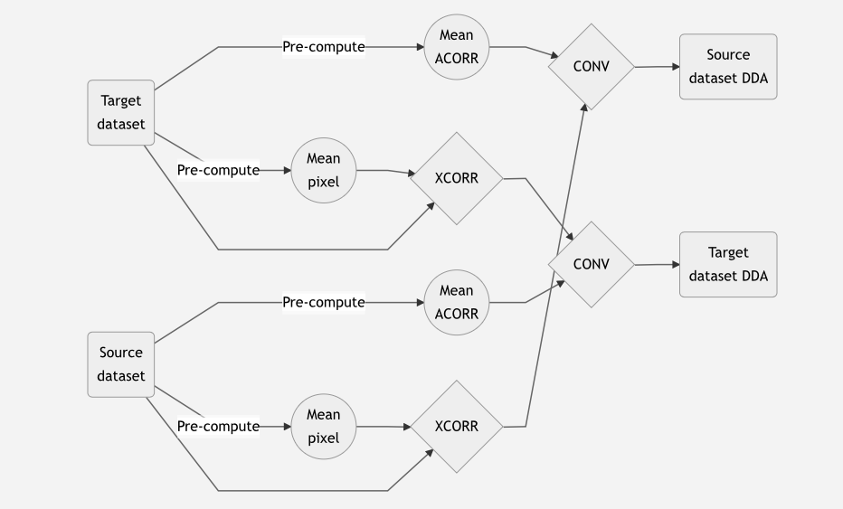

# Domain adaptation through mutual linear transformations

This is the PyTorch implementation of workflow and experiments from  **"[Direct domain adaptation through mutual linear transformations](place_link_here!)"** by [Tariq Alkhalifah](https://sites.google.com/a/kaust.edu.sa/tariq/) and [Oleg Ovcharenko](https://ovcharenkoo.com/), 2021.

## Method
We propose the direct domain adaptation (DDA) approach to reduce the domain gap between two datasets. The process includes a series of linear operations on both datasets :
 1) Cross-correlation of the input data with the a sample pixel (or the mean of sample pixels) from images of the same domain. 
 2) Convolution of the previous result with the mean of the auto-correlated input data from the other domain.
 
In the training stage, the input data are from the source domain and the mean of auto-correlated images is from the target domain. In the inference/application stage, the input data are from the target domain and the mean of auto-correlated images is from the source domain. The proposed method does not explicitly interfere with the training workflow and network architecture so might be incorporated into existing routines.

----------
The only difference between data manipulations at the training and inference stages is that _during training a random pixel_ from the same dataset is used for cross-correlation, rather than the _mean of random pixels_ at the inference stage.
### Training 

### Testing 

## Classification accuracy
The notebooks in this repository explore performance of the DDA method against several setups when transferring knowledge from MNIST to MNIST-M datasets. 
* The experiment 1 simply reproduces the  [DANN](https://github.com/fungtion/DANN_py3) training, where a generative adversarial networks reduces the domain gap in the layers of the network. 
* In the experiment 2, we extract the generator part of the previous and use it as a benchmark CNN architecture when no any domain adaptation methods are applied. 
* The experiment 3 is similar to the previous but processing the data on the fly according to the DDA workflow.

|         | DANN | CNN  | CNN+DDA |
|--------|------|------|---------|
| MNIST  | 0.988 | 0.996 | 0.990    |
| MNIST-M  | 0.911 | 0.344 | 0.734    |

### Download MNIST-M dataset
Follow instructions in [this repo]{https://github.com/fungtion/DANN_py3} to download the target MNIST-M dataset.

### Acknowledgements
The code is built over  [Unsupervised Domain Adaptation by Backpropagation](https://github.com/fungtion/DANN_py3).
